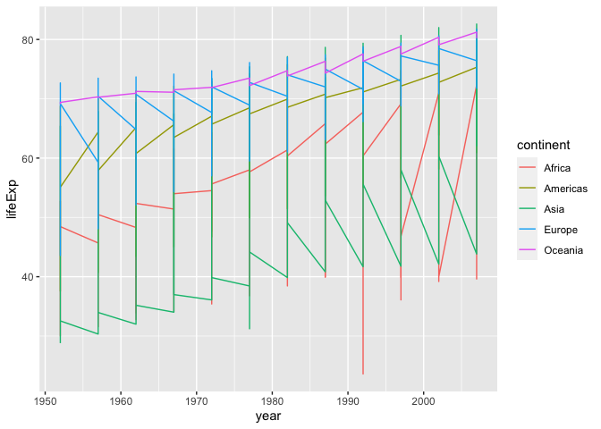
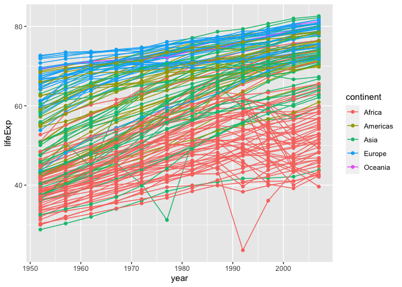
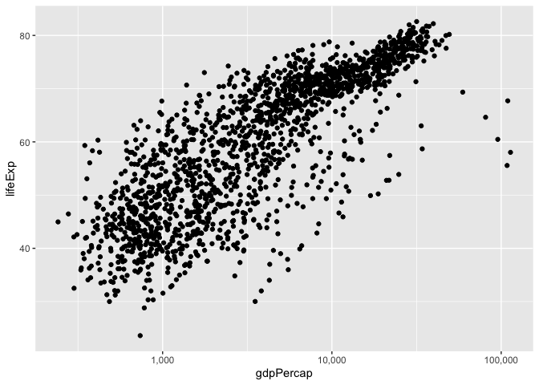
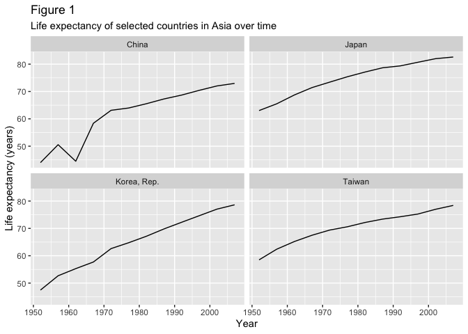

# Reproducible Data Analysis Day 5: Data visualization with ggplot2

### Learning Objectives

By the end of this class, you should be able to do the following:

- Use ggplot2 to generate publication-quality graphics.
- Apply geometry and aesthetic layers to a ggplot plot.
- Manipulate the aesthetics of a plot using different colors, shapes,
  and lines.
- Improve data visualization through transforming scales and paneling by
  group.
- Save a plot created with ggplot to disk.

## About plotting and ggplot2

Plotting our data is one of the best ways to quickly explore it and the
various relationships between variables.

Today we’ll be learning about the ggplot2 package, because it has a
consistent syntax and can be used to produce publication-quality
graphics.

ggplot2 is built on the grammar of graphics, the idea that any plot can
be built from the same set of components: a **data set**, **mapping
aesthetics**, and graphical **layers**:

- **Data sets** are the data that you, the user, provide.

- **Mapping aesthetics** are what connect the data to the graphics. They
  tell ggplot2 how to use your data to affect how the graph looks, such
  as changing what is plotted on the X or Y axis, or the size or color
  of different data points.

- **Layers** are the actual graphical output from ggplot2. Layers
  determine what kinds of plot are shown (scatterplot, histogram, etc.),
  the coordinate system used (rectangular, polar, others), and other
  important aspects of the plot. The idea of layers of graphics may be
  familiar to you if you have used image editing programs like
  Photoshop, Illustrator, or Inkscape.

Let’s start off building an example using the gapminder data from
earlier. The most basic function is `ggplot`, which lets R know that
we’re creating a new plot. Any of the arguments we give the `ggplot`
function are the *global* options for the plot: they apply to all layers
on the plot.

## Getting started

Today we will continue using the local project that you created before,
`gapminder-analysis`, located in the `data-analysis-course` folder on
your Desktop. Open it by clicking on the `gapminder-analysis.Rproj`
file.

Since `ggplot2` is included in `tidyverse`, we will first load the
`tidyverse` set of packages. Also load the `scales` package, which is
used for labeling plots.

``` r
library(tidyverse)
```

    ── Attaching core tidyverse packages ──────────────────────────────────────────────────────────────────────────────────────────────────────────────────────────────────────────────────────────────────────────────────────────────────────────────────────────────────────────────────── tidyverse 2.0.0 ──
    ✔ dplyr     1.1.2     ✔ readr     2.1.4
    ✔ forcats   1.0.0     ✔ stringr   1.5.0
    ✔ ggplot2   3.4.2     ✔ tibble    3.2.1
    ✔ lubridate 1.9.2     ✔ tidyr     1.3.0
    ✔ purrr     1.0.1     
    ── Conflicts ────────────────────────────────────────────────────────────────────────────────────────────────────────────────────────────────────────────────────────────────────────────────────────────────────────────────────────────────────────────────────────────────────── tidyverse_conflicts() ──
    ✖ dplyr::filter() masks stats::filter()
    ✖ dplyr::lag()    masks stats::lag()
    ℹ Use the conflicted package (<http://conflicted.r-lib.org/>) to force all conflicts to become errors

``` r
library(scales)
```


    Attaching package: 'scales'

    The following object is masked from 'package:purrr':

        discard

    The following object is masked from 'package:readr':

        col_factor

Next, load the data as before.

``` r
gapminder <- read_csv("data_raw/gapminder.csv")
```

    Rows: 1704 Columns: 6
    ── Column specification ────────────────────────────────────────────────────────────────────────────────────────────────────────────────────────────────────────────────────────────────────────────────────────────────────────────────────────────────────────────────────────────────────────────────────
    Delimiter: ","
    chr (2): country, continent
    dbl (4): year, lifeExp, pop, gdpPercap

    ℹ Use `spec()` to retrieve the full column specification for this data.
    ℹ Specify the column types or set `show_col_types = FALSE` to quiet this message.

We are now ready to plot the data.

## First plot

Let’s start off building an example using the gapminder data from
earlier. The most basic function is `ggplot`, which lets R know that
we’re creating a new plot. Any of the arguments we give the `ggplot`
function are the *global* options for the plot: they apply to all layers
on the plot.

``` r
ggplot(data = gapminder)
```


Here we called `ggplot` and told it what data we want to show on our
figure. This is not enough information for `ggplot` to actually draw
anything. It only creates a blank slate for other elements to be added
to.

Now we’re going to add in the **mapping aesthetics** using the `aes`
function. `aes` tells `ggplot` how variables in the **data** map to
*aesthetic* properties of the figure, such as which columns of the data
should be used for the **x** and **y** locations.

``` r
ggplot(data = gapminder, mapping = aes(x = gdpPercap, y = lifeExp))
```


Here we told `ggplot` we want to plot the “gdpPercap” column of the
gapminder data frame on the x-axis, and the “lifeExp” column on the
y-axis. Notice that we didn’t need to explicitly pass `aes` these
columns (e.g. `x = gapminder[, "gdpPercap"]`), this is because `ggplot`
is smart enough to know to look in the **data** for that column!

The final part of making our plot is to tell `ggplot` how we want to
visually represent the data. We do this by adding a new **layer** to the
plot using one of the **geom** functions.

``` r
ggplot(data = gapminder, mapping = aes(x = gdpPercap, y = lifeExp)) +
  geom_point()
```


Here we used `geom_point`, which tells `ggplot` we want to visually
represent the relationship between **x** and **y** as a scatterplot of
points.

## Layers

Using a scatterplot probably isn’t the best for visualizing change over
time. Instead, let’s tell `ggplot` to visualize the data as a line plot:

``` r
ggplot(data = gapminder, mapping = aes(x=year, y=lifeExp, color=continent)) +
  geom_line()
```



Instead of adding a `geom_point` layer, we’ve added a `geom_line` layer.

However, the result doesn’t look quite as we might have expected: it
seems to be jumping around a lot in each continent. Let’s try to
separate the data by country, plotting one line for each country:

``` r
ggplot(data = gapminder, mapping = aes(x=year, y=lifeExp, group=country, color=continent)) +
  geom_line()
```


We’ve added the **group** *aesthetic*, which tells `ggplot` to draw a
line for each country.

But what if we want to visualize both lines and points on the plot? We
can add another layer to the plot:

``` r
ggplot(data = gapminder, mapping = aes(x=year, y=lifeExp, group=country, color=continent)) +
  geom_line() + geom_point()
```



It’s important to note that each layer is drawn on top of the previous
layer. In this example, the points have been drawn *on top of* the
lines. Here’s a demonstration:

``` r
ggplot(data = gapminder, mapping = aes(x=year, y=lifeExp, group=country)) +
  geom_line(mapping = aes(color=continent)) + geom_point()
```


In this example, the *aesthetic* mapping of **color** has been moved
from the global plot options in `ggplot` to the `geom_line` layer so it
no longer applies to the points. Now we can clearly see that the points
are drawn on top of the lines.

### Tip: Setting an aesthetic to a value instead of a mapping

So far, we’ve seen how to use an aesthetic (such as **color**) as a
*mapping* to a variable in the data. For example, when we use
`geom_line(mapping = aes(color=continent))`, ggplot will give a
different color to each continent. But what if we want to change the
color of all lines to blue? You may think that
`geom_line(mapping = aes(color="blue"))` should work, but it doesn’t.
Since we don’t want to create a mapping to a specific variable, we can
move the color specification outside of the `aes()` function, like this:
`geom_line(color="blue")`.

## Transformations

Currently it’s hard to see the relationship between the points due to
some strong outliers in GDP per capita. We can change the scale of units
on the x axis using the *scale* functions. These control the mapping
between the data values and visual values of an aesthetic. We can also
modify the transparency of the points, using the *alpha* function, which
is especially helpful when you have a large amount of data which is very
clustered.

``` r
ggplot(data = gapminder, mapping = aes(x = gdpPercap, y = lifeExp)) +
  geom_point() +
  scale_x_log10()
```


The `scale_x_log10` function applied a transformation to the coordinate
system of the plot, so that each multiple of 10 is evenly spaced from
left to right. For example, a GDP per capita of 1,000 is the same
horizontal distance away from a value of 10,000 as the 10,000 value is
from 100,000. This helps to visualize the spread of the data along the
x-axis.

You may not be used to reading scientific notation. We can change the
way the labels on the x-axis appear using the `labels` argument of the
`scale_x_log10()` function:

``` r
ggplot(data = gapminder, mapping = aes(x = gdpPercap, y = lifeExp)) +
  geom_point() +
  scale_x_log10(labels = label_comma())
```



## Multi-panel figures

Earlier we visualized the change in life expectancy over time across all
countries in one plot. Alternatively, we can split this out over
multiple panels by adding a layer of **facet** panels.

We start by making a subset of data including only some countries
located in Asia. (Otherwise, there are too many countries to plot).

``` r
gapminder_asia <- filter(
  gapminder,
  country %in% c("Japan", "China", "Korea, Rep.", "Taiwan"))
```

Use `facet_wrap()` to create the facets. Note that within
`facet_wrap()`, you need to specify the variable to use for grouping the
facets with `vars()`. Here, we group the facets by country; in other
words, each facet is one country.

``` r
ggplot(
  gapminder_asia,
  aes(
    x = year,
    y = lifeExp)) +
  geom_line() +
  facet_wrap(vars(country))
```


## Modifying labels

To clean this figure up for a publication we need to change some of the
labels. The y axis should read “Life expectancy”, rather than the column
name in the data frame. It’s also a good idea to indicate the units of
the data (years for life expectancy).

You can change these using the `labs()` function. You set the value of
each label as a character string (for example, `x = "Year"`, etc.):

``` r
ggplot(
  gapminder_asia,
  aes(
    x = year,
    y = lifeExp)) +
  geom_line() +
  facet_wrap(vars(country)) +
  labs(
    x = "Year",              # x axis title
    y = "Life expectancy (years)",   # y axis title
    title = "Figure 1",       # main title of figure
    subtitle = "Life expectancy of selected countries in Asia over time"
  )
```



## Exporting the plot

First, re-run the code above, and save the output in R to an object,
which we will call `gapminder_asia_plot`.

``` r
gapminder_asia_plot <- ggplot(
  gapminder_asia,
  aes(
    x = year,
    y = lifeExp)) +
  geom_line() +
  facet_wrap(vars(country)) +
  labs(
    x = "Year",
    y = "Life expectancy (years)",
    title = "Figure 1",
    subtitle = "Life expectancy of selected countries in Asia over time"
  )
```

Next, use the `ggsave()` function to export the plot to a file. You can
specify the dimension and resolution of your plot by adjusting the
appropriate arguments (`width`, `height` and `dpi`) to create high
quality graphics for publication. In order to save the plot from above,
we first assign it to a variable `lifeExp_plot`, then tell `ggsave` to
save that plot in `pdf` format. You can also specify other formats like
`pdf` or `jpg`.

``` r
ggsave(plot = gapminder_asia_plot, file = "gapminder_asia.pdf")
```

### Tip: Don’t commit output

As a general rule, you should not commit the output of code to your
repository. That is because you can reproduce the output from the code
(which you **should** commit) and the data (which is **read-only**).
Best practice is to create a folder for storing results called
`results/`, and add this folder to your `.gitignore` so that anything
that it contains will be excluded from your git repo.

To save the above plot to the `results` folder, modify the `file`
argument to look like this (make sure to create `results` first!):

``` r
ggsave(plot = gapminder_asia_plot, file = "results/gapminder_asia.pdf")
```

## Submitting the homework

Go to Moodle, click on the Day 5 Homework assignment, and click on the
link to accept the assignment. This will create the repo in your GitHub
account.

Next, clone the remote repo to your local machine. Then, edit the file
`day_05_homework.R` file in RStudio. Make sure that your code runs
without errors. Once you have done so, commit your changes and push to
the remote. Don’t forget to push! If you don’t push, your work will not
be submitted.

Finally, go to Moodle and submit your assignment there by clicking
“提出物をアッ プロード・入力する” and entering the URL of your repo. For
this assignment, mine looks like this:
`https://github.com/data-analysis-chiba-2023/day05-ggplot-joelnitta`

Be sure to do this BY THE DEADLINE, or your work will not be counted.

## Attributions

These materials were modified by Joel H. Nitta from those posted at
https://swcarpentry.github.io/r-novice-gapminder/ under the [Creative
Commons Attribution (CC BY 4.0)
license](https://creativecommons.org/licenses/by/4.0/).
